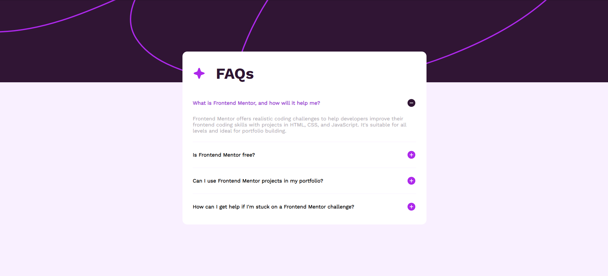
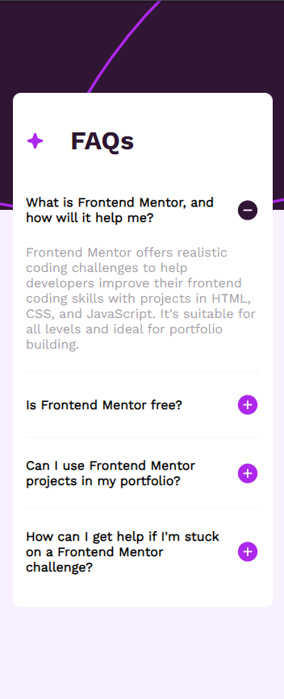

# Frontend Mentor - FAQ accordion solution

This is a solution to the [FAQ accordion challenge on Frontend Mentor](https://www.frontendmentor.io/challenges/faq-accordion-wyfFdeBwBz). Frontend Mentor challenges help you improve your coding skills by building realistic projects. 

## Table of contents

- [Overview](#overview)
  - [The challenge](#the-challenge)
  - [Screenshot for desktop](#screenshot)
  - [Screenshot for](#screenshot)
  - [Links](#links)
- [My process](#my-process)
  - [Built with](#built-with)
  - [What I learned](#what-i-learned)
  - [Continued development](#continued-development)
  - [Useful resources](#useful-resources)
- [Author](#author)

## Overview

### The challenge


Users should be able to:

- Hide/Show the answer to a question when the question is clicked
- Navigate the questions and hide/show answers using keyboard navigation alone
- View the optimal layout for the interface depending on their device's screen size
- See hover and focus states for all interactive elements on the page


### Screenshot for desktop





### Screenshot for mobile




## My process

### Built with


- HTML5
- CSS3
- Flexbox
- JavaScript


### What I learned


As a beginner in JavaScript, I was able to familiarize myself with events and functions with the help of this challenge.

```js
const displayFaqTextContent = (parent, whichTextContent, selector) => {
    parent.addEventListener("click", () => {
        whichTextContent.classList.toggle('display-hidden');
        const icon = document.querySelector(selector);
        if (icon.src.includes('icon-plus.svg')) {
            icon.src = minusIconSrc;
        } else {
            icon.src = plusIconSrc;
        }
    })
}
```

### Continued development

I think I should have better considered the link between HTML and JavaScript. 

The ideal would have been to integrate the paragraphs in a div sharing the same parent as the h2 and image div.


## Author

- Frontend Mentor - [@WebisBrian](https://www.frontendmentor.io/profile/WebisBrian)
- Github - [@WebisBrian](https://github.com/WebisBrian)
- LinkedIn - (https://inkedin.com/in/brian-tabart)
